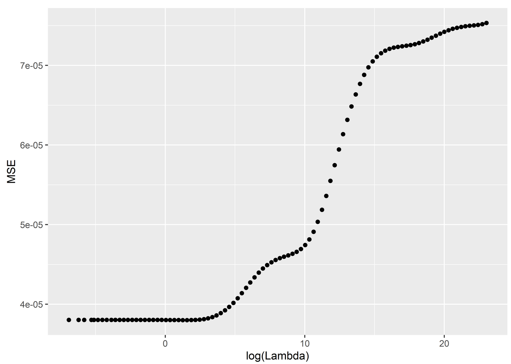
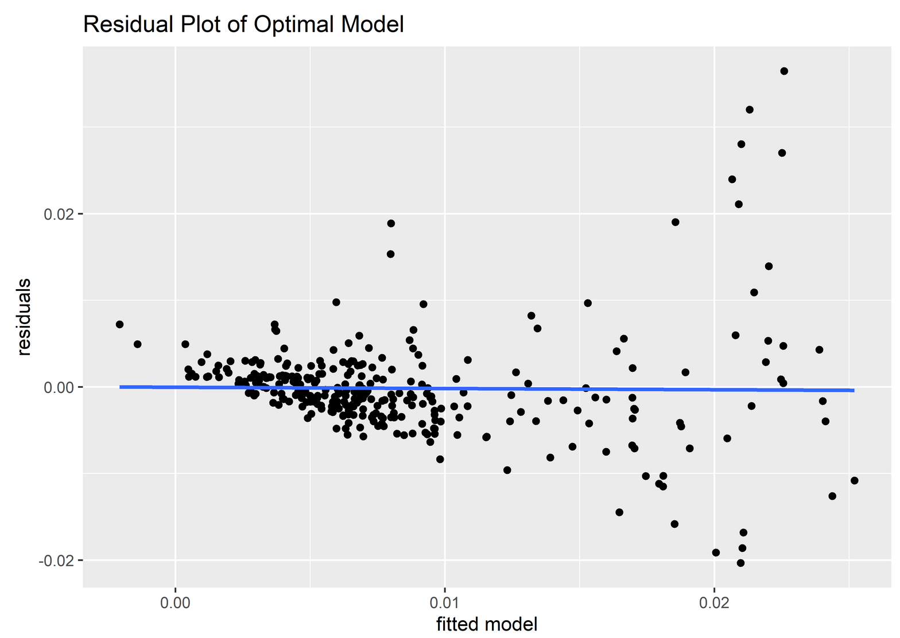
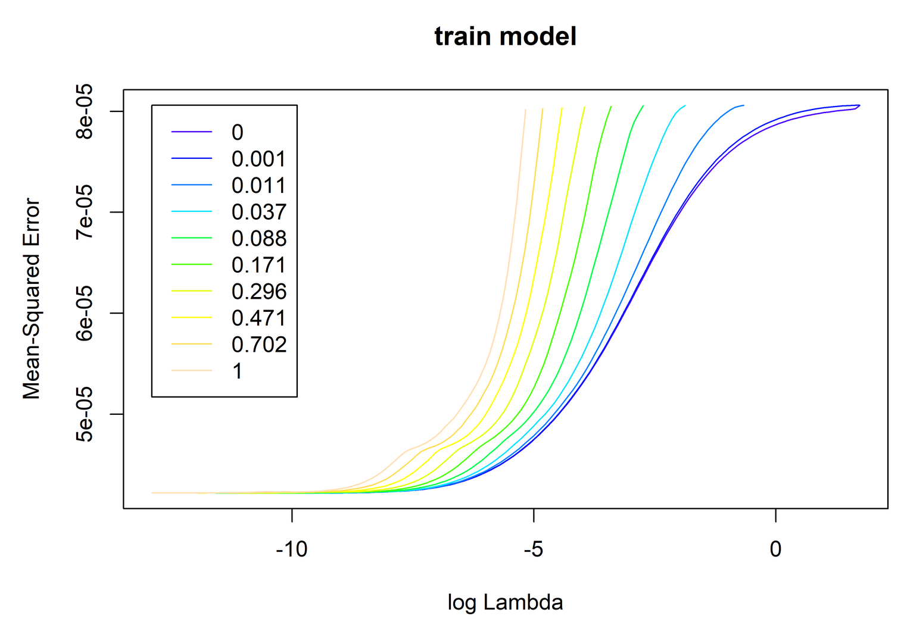
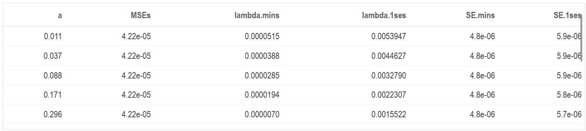
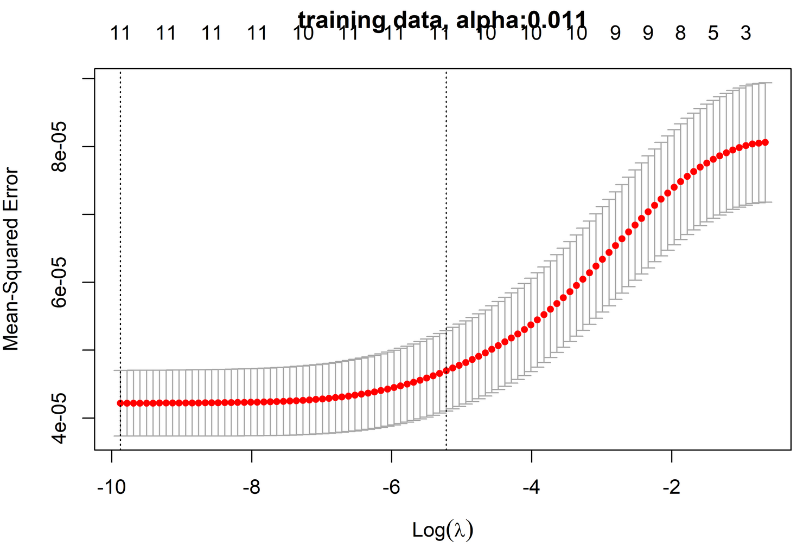
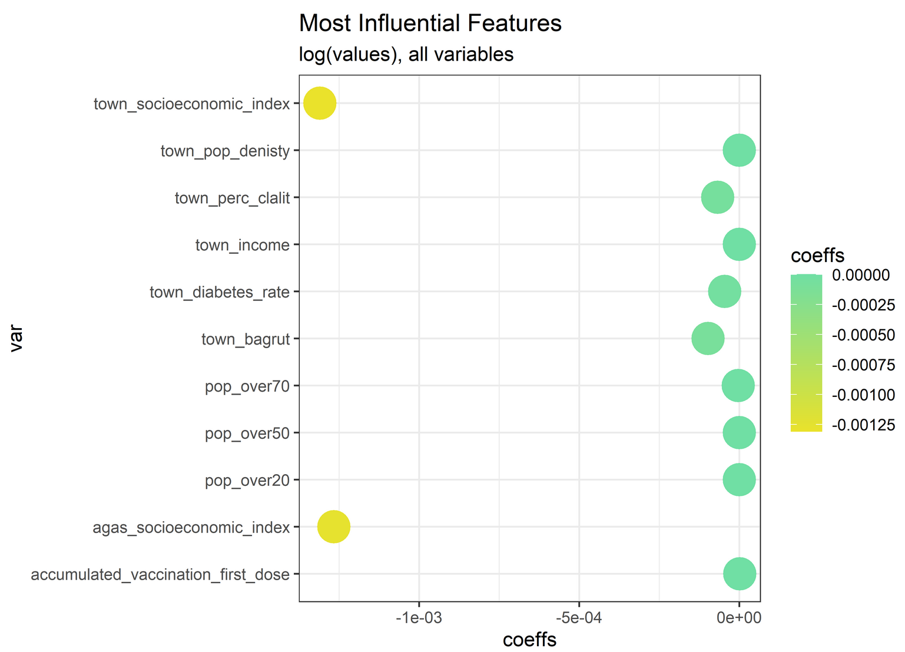

# Coronavirus Cases and Demographic Analysis in Israel

This project aims to model and predict a response variable new_cases/population (where new_cases represents new cases of coronavirus on a specific day in Israel by town/locality, and population is the corresponding population size) according to a selection of various demographic variables in a corresponding town/locality in Israel. I decide to first fit Ridge regression models of various lambdas on the data (all done manually, i.e. independently defined ridge fitting functions) and interpret the results. Then fit models using cross-validation in accordance with the 'glmnet' R package to estimate optimal lambda and alpha parameters (so perhaps rather Lasso or ElasticNet), and finally calculate an RMSPE (root mean squared predicted error) of the model according to test and validation data sets.

### Important notes
The code related to the project is done in R, but saved in a .Rmd file. I attached an html knit of the code as well, however, the file is too big to preview on github. To remedy this, you can click on the html file, click on 'View raw', then copy and paste the URL of the raw version of the html on this site: https://htmlpreview.github.io/. This will enable you to view the results and the plots as well as the code. The code includes an interactive bubble map which is still omitted from the original html, but I have included a screenshot of the bubble map as a .png which I will also show below:

Our aim for this section is to create a graph that represents and opens up a possible discussion about the relationship between new_cases of the coronavirus in Israel from our data set with some selection of variables from our demographics data set.

We choose to pick 4 total variables: new_cases, town_east_coord & town_north_coord (coordinates of the towns/localities), and population. We will represent the data in an interactive map using the leaflet package, but to do so we must scale the coordinates of our data set to fit appropriately with the leaflet functions (did this by trial and error).


Our final output above is an interactive bubble map of the new cases in Israel (zoom-able too). The data that is used are the coordinates, the names of the towns, the town codes, their populations, and new cases. We have a legend to show the range of the colors, and the size of the points are determined by the size of the populations of the towns. Hovering over a point gives you all of the information. We can see that the cases hit certain areas more than others, as expected since the more populated areas and developed cities will have more movement. One interesting thing worth noting though is how the towns up north which have decently sized populations were not too infected. This suggests that the northern (and southern) towns probably had less in-and-out movement/travelers compared to the more central towns.

In this next section we will implement a Ridge regression on our data *manually* to fit a model of a new_cases/population (the response variable) with various dependent variables of our choosing.

To split the training data set into train + validation data sets, using our previous analysis from section 1, I wanted to keep in mind to sample towns from throughout its distribution. If I randomly sampled/split the data, since the more populated areas have the same town names and town-statistics, I wanted to ensure that I had sampled from every town/region. This is called stratified sampling, and in our case, with respect to the towns. I also disregarded the string variables and agas + town codes, and decided to keep all the other numerical variables to further in my analysis. I also took out NA values, which may make way for almost negligible bias, but it turned out that when I calculated the MSE, it was better this way than to replace the values with their means/medians. This is probably because this data set is large, however I will do it for the final testing data set in the end because it is smaller so it won’t affect as much and may prevent bias.
```
##              MSE Lambda
## y71 3.800741e-05  4.751
```



The plot above illustrates the MSE (minimum square error) of each model as a function of log(lambda). We can choose the model and lambda according to the minimum MSE.
Here we will show the aforementioned optimal model (the coeffs according to the chosen lambda value).
```
##                                          4.751
## accumulated_vaccination_first_dose  0.00000733
## town_pop_denisty                    0.00000000
## town_diabetes_rate                 -0.00001440
## town_perc_clalit                   -0.00004846
## town_income                         0.00000239
## town_bagrut                        -0.00011459
## town_socioeconomic_index           -0.00704723
## agas_socioeconomic_index           -0.00391984
## pop_over20                         -0.00000183
## pop_over50                          0.00000091
## pop_over70                         -0.00000772
```

I used the formulas defined from the mathematical definition of Ridge regression to not only calculate the Ridge regression, but also to predict the y response through the validation data set. I did this for multiple values of lambda ranging from 0.001 - 10^10 (split by 100 numbers). After doing so, I calculated the MSE for each and identified the model and predictions with the lowest score.



As expected, the abline of the residual plot resides on the 0, since their expectation is 0. Seeing as how many of the points on the left-half of the graph are close to the origin, but have the right-half more dispersed, this signifies some heteroscedasticity. This signifies that there are varying/differing variances among the features/explanatory variables.


In this last section we will fit models using cross-validation in accordance to the ‘glmnet’ package to estimate optimal parameters for lambda and alpha (so not necessarily ridge, but perhaps Lasso or ElasticNet).
Here we split our data as we have done previously, implement our cross-validation and represent the results of the MSE of each model (for different alphas) as a function of log(lambda) in a plot.



We can see that for a certain lambda, the MSE becomes almost indistinguishable among certain values for alpha. Nevertheless, we can see that smaller values for alpha will probably provide a better model than those greater (according to the MSE).

Let us create a table displaying all the parameters of the model(s) arranged by the best MSE value.



The MSE of the optimal model (optimal alpha) as a function of log(lambda) with error bars.



We can represent the coefficients of the model in a plot to determine which are the most influential features of the model.



We can see that town/agas_socioeconomic_index features are much more influential than the rest, while the coordinates,populations,and so on, are not. Using Ridge, it would have probably given coefficients to all of the variables, Lasso on the other hand can be known to over-regularize. This is why cross validating the alpha will tend to provide the most successful result when it comes to building the optimal model and predicting our data. Nevertheless, since we do not have the true y/response for the test data set, we will use our forecast/prediction from the Ridge model that we made in question 2 to help estimate the RMSPE. It should, in theory, help provide us with a somewhat relevant estimate of the true RMSPE. And this is precisely what we will do below.

```
## [1] "Estimated RMSPE of validation dataset:  0.007"
## [1] "Estimated RMSPE of test dataset:  0.004"

```

### Further context
This project is a part of a submission relating to my coursework in statistics in The Hebrew University of Jerusalem; the specific course in reference is 'Statistical Learning and Data Analysis' (52525). The data sets included in these analyses are the coronavirus cases from 24/12/2020-7/1/2020 in Israel by locality, as well as the demographic data of each locality; both of these data sets can be found on Israel's Ministry of Health website, I will include a link to the dashboard but keep in mind it can only be navigated in Hebrew: https://datadashboard.health.gov.il/COVID-19/general?utm_source=go.gov.il&utm_medium=referral. 


